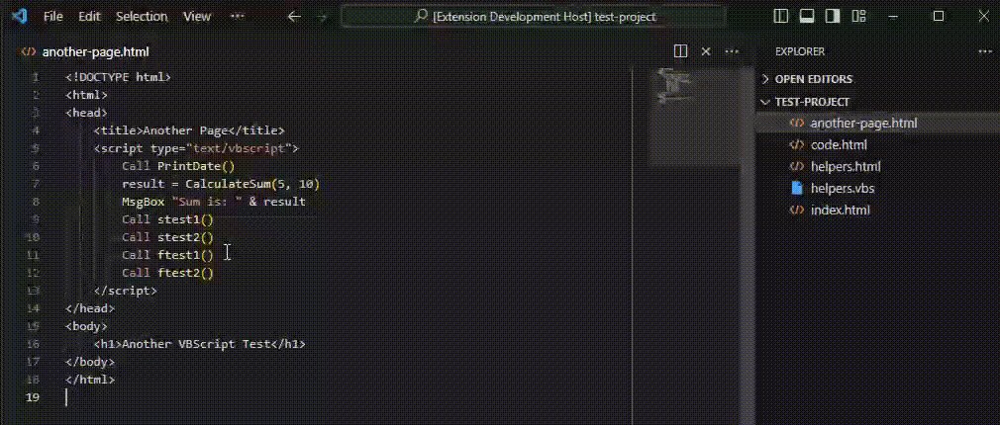

# Classic ASP Function Search README

This is the README for the "Classic ASP Function Search" extension. This extension is specifically designed for Classic ASP applications, enabling developers to quickly locate and jump to function definitions within VBScript in HTML, ASP, and VBS files. It integrates seamlessly with your development environment, providing an efficient method for accessing function implementations and improving code navigation.

## Features

"Classic ASP Function Search" offers the following features:
- Easily jump to function and subroutine definitions in VBScript within HTML and ASP files.
- Supports searching across multiple files, including `.html`, `.asp`, and `.vbs`.
- Caches search results for quicker access and reduced search times.
- Clear cache automatically when files are changed.

## Requirements

There are no additional requirements or dependencies needed to use this extension beyond Visual Studio Code version 1.85.0 or higher.

## Extension Settings

This extension does not add any specific VS Code settings through the `contributes.configuration` extension point at this time.

## Known Issues

No known issues at this time. Please report any issues encountered on the repository's issue tracker.

## Release Notes

### 0.0.1

- Initial release of "Classic ASP Function Search".
- Support for `.html`, `.asp`, and `.vbs` files.
- Ability to find function and subroutine definitions within files.